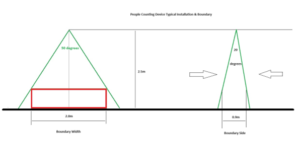
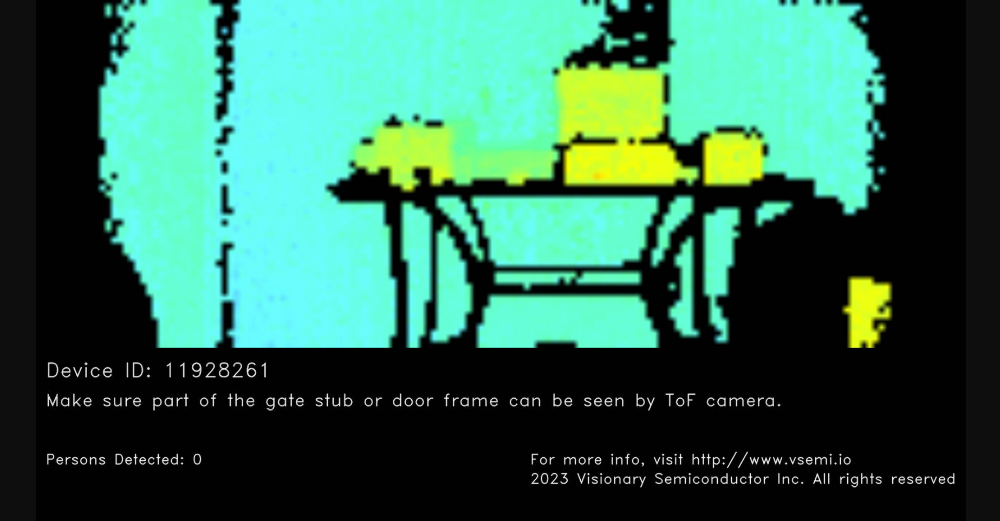
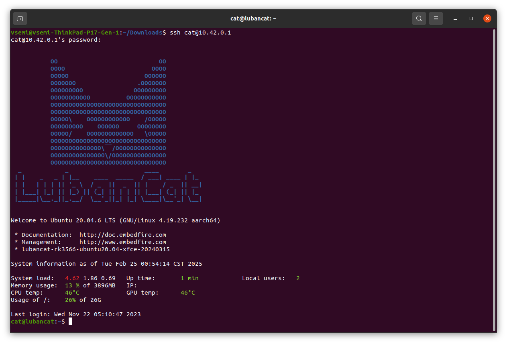
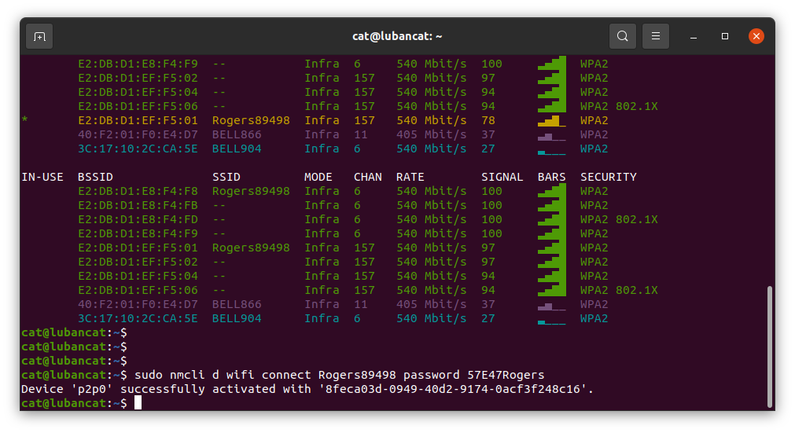
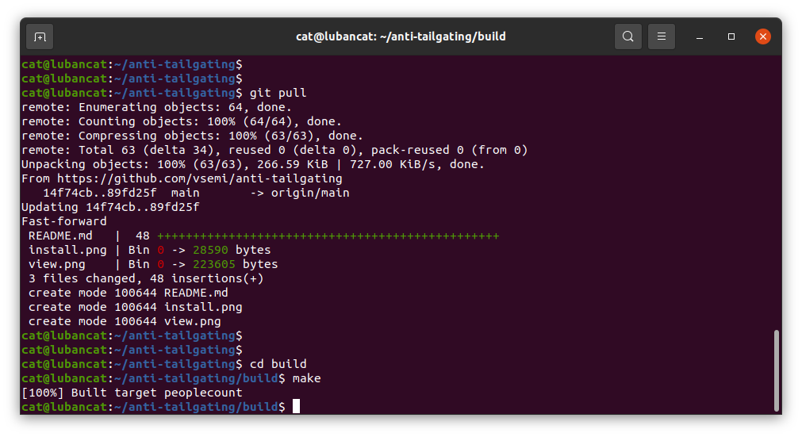

# List of Components and Tools:

#### 1. 5V USB Type-C power adaptor

### Optional:

#### 2. Personal computer
#### 3. Self-powered USB hub
#### 4. USB Type-A to USB Type-C cable
#### 5. WiFi connection

# Very important: 

#### 1. the device should be firmly installed and facing down straight, loosing or shaking will seriously impact the accuracy of detection
#### 2. Power off at least 10 seconds and power on again to reboot the device after every time adjusted installation
#### 3. make sure there is no person or any non-fixed objects in the FOV area, ie ladders, stools, boxes etc, before powering on the device
#### 4. If there are doors possibley visible by the sensor, close all of the doors before powering on the device

#### 5. USB cable to be used in this instruction, needs to be high-quality Type-A to Type-C cable. Some low quality Type-C cables ie for phone charger, will not work for high speed data transition.

# Installing Device

Ideally, the device should be installed 2.5 to 3.5 meters above the ground, directly above the entrance, and facing down. Refer to below image for device field of view.



# Quick Start

#### 1. Connect the people counting device to 5V USB Type-C power adaptor
#### 2. Wait for the 10 fast blinks of the green light and the yellow light start to blink about every 3 seconds
#### 3. Device is ready

# Relay

#### Relay is low-effective

#####   (Black):  GND

##### 1 (Blue):   zero person
##### 2 (Green):  one person
##### 3 (Yellow): two persons
##### 4 (White):  suspicious

#####   (Red):    +5V

# View depth image and review boundary

#### When the device is working on view mode, response will be slower than regular mode

#### 1. Power on PC
#### 2. Power on the Self-powered USB hub
#### 3. Connect Self-powered USB hub to PC
#### 3. Connect the people counting device to Self-powered USB
#### 4. Wait for the yellow light start to blink about every 3 seconds
#### 5. Launch web browser and enter http://10.42.0.1:8800 in the browser address bar



# Software Update

## Connect to device console

#### 1. Power on PC
#### 2. Power on the Self-powered USB hub
#### 3. Connect Self-powered USB hub to PC
#### 3. Connect the people counting device to Self-powered USB
#### 4. Wait for the yellow light start to blink about every 3 seconds
#### 5. Connect to device IP address cat@10.42.0.1 (user name: cat, password: temppwd)
##### Linux: 
```
ssh cat@10.42.0.1
```
##### Windows: tool such as Putty or MobaXterm can be used



## Connect to wifi

#### Run command: 
```
sudo nmcli d wifi list
```
#### Find the WIFI name that is desired, replace your wifi name and password and run following command:
```
sudo nmcli d wifi connect <WIFI_NAME> password <WIFI_PASSWORD> 
```



## Update Software

#### Run command: 

```
sudo systemctl stop peoplecount
cd ~/anti-tailgating
git pull
cd build
make
exit
```



#### Power down and connect the people counting device back to 5V USB Type-C power adaptor

# Record Data

## Connect to device console

## Modify startup script

#### Run command: 

```
sudo vi peoplecount_start.sh
```
File peoplecount_start.sh openned for edit

Modify the line:
```
sudo /home/cat/anti_tailgating/build/peoplecount train-detect
```
change to:
```
sudo /home/cat/anti_tailgating/build/peoplecount train-record
```

Unplug the USB cable which connected to PC, and plug in 5V power adptor.

Now the device in Data Recording mode

After data recorded, follow step of "Modify startup script" to change the startup script back to:

```
sudo /home/cat/anti_tailgating/build/peoplecount train-detect
```

## Retrieve recorded data

```
tar -czvf data.tar.gz data

scp data.tar.gz ./
```
